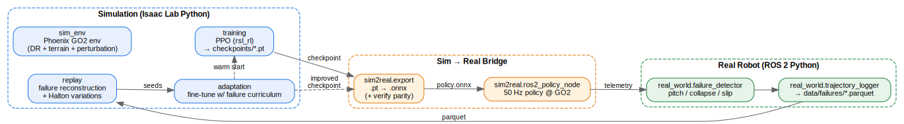

# go2-phoenix

**Closed-loop sim-to-real learning for the Unitree GO2 quadruped.**

For on-robot deployment, see [`go2_phoenix_deploy_prompt.txt`](./go2_phoenix_deploy_prompt.txt).

The Phoenix loop trains a locomotion policy in simulation, deploys it to the
real robot, captures the failures that happen on hardware, replays those
failures in simulation under a randomized physics sweep, and fine-tunes the
policy on that failure-seeded distribution. The improved policy goes back
to the robot. Every stage of the loop is a concrete Python module with its
own CLI, configuration, and (where possible) unit tests.



```
SIM train  ──▶  ONNX export  ──▶  ROS 2 deploy  ──▶  GO2 hardware
    ▲                                                      │
    │                                                      ▼
    │                                        failure detector + parquet log
    │                                                      │
    └────── fine-tune (failure curriculum) ◀── replay w/ Halton variations
```

## Current results (2026-04-14)

### Baseline training — 500 iters, rough terrain

| Policy | Terrain | Mean return | Success | Episodes |
|---|---|---:|---:|---:|
| `model_100.pt` (early) | rough     | 14.22 | 81.2% | 16 |
| `model_499.pt` (final) | rough     | **18.95** | **100%** | 16 |

### Fine-tune adaptation — 200 iters, warm-started from baseline

| Policy | Terrain | Mean return | Success | Episodes |
|---|---|---:|---:|---:|
| `phoenix-base/latest.pt`  | slippery | 15.90 | 90.6%  | 64 |
| `phoenix-adapt/latest.pt` | slippery | **16.64** | **100%** | 64 |
| `phoenix-adapt/latest.pt` | rough    | 17.56 | 96.9% | 64 |

Baseline gets rough right (100%) but slips on slippery (90.6%). The
adapted policy trades ~3 pp of rough-terrain success for closing the
entire slip gap on slippery terrain — 100% success, +0.74 in return.

> **What this is and isn't.** The adaptation here is plain warm-start
> PPO on the ``slippery.yaml`` overlay (low friction). It is **not** a
> failure-curriculum result — ``configs/train/adaptation.yaml`` ships
> with ``failure_sample_fraction: 0.0`` because the failure
> reset-bridge has no hardware-captured parquets to validate against
> yet. A smoke config (``configs/train/adaptation_smoke.yaml``)
> exercises the curriculum plumbing with synthesized parquets but is
> not the producer of the numbers above. See "Known limitations" below.

### Sim-to-sim artifacts

* 500-iter PPO baseline trained on `Isaac-Velocity-Rough-Unitree-Go2-v0`,
  4096 parallel envs, RTX 5070, ~28 min wall time; 200-iter fine-tune
  adds ~11 min.
* ONNX export passes parity check (max torch↔onnxruntime abs-diff 2.98e-6).
* Failure parquet synthesizer produces 200-step rollouts with
  attitude/collapse/slip flags. ``replay/reconstruct.py`` spawns N sim
  envs from the logged initial state and applies a Halton-sampled
  per-env perturbation (mass, push velocity, push yaw) — exercised in
  unit tests against the pure-numpy translation in
  ``replay/apply_variations.py``; the Isaac Sim hand-off itself is sim-
  only, so it cannot run in CI.
* Side-by-side demo videos:
  [`media/side_by_side.mp4`](media/side_by_side.mp4) (training progress)
  and [`media/side_by_side_adapt.mp4`](media/side_by_side_adapt.mp4)
  (baseline on slippery | baseline on rough | adapted on slippery).

---

## Why this repo exists

Most open-source quadruped RL projects stop at "trained in sim, deployed
once." Phoenix is explicitly about the *loop that happens after the first
deployment*: reproducing real failures in sim, using them as training
seeds, and shipping a better policy. The full pipeline is automated by
five shell scripts and driven by YAML configs.

---

## Repository layout

```
configs/            layered YAML: env + train + adapt + replay + deploy
scripts/            train.sh · deploy.sh · replay.sh · adapt.sh · demo.sh
src/phoenix/
    sim_env/        GO2 env factory on top of Isaac Lab's rough-terrain task
    training/       PPO (rsl_rl) + evaluation rollouts
    sim2real/       ONNX export (with parity check), ROS 2 policy node
    real_world/     rule-based failure detector, Parquet trajectory logger
    replay/         Halton variation sampler + Isaac Sim reconstruction
    adaptation/     failure-curriculum fine-tuning
    demo/           side-by-side video pipeline (ffmpeg)
tests/              unit tests (pure-python pieces; run in CI)
docs/               architecture diagram + design notes
docker/             CPU-only testbox for CI
```

---

## Quick start

```bash
# 1. Install Isaac Lab 3.0+ (https://isaac-sim.github.io/IsaacLab/).
export ISAACLAB_PATH=$HOME/IsaacLab

# 2. Train a baseline policy (~4 h on RTX 5070 at 4096 envs)
./scripts/train.sh configs/train/ppo.yaml

# 3. Export to ONNX and deploy on the GO2
./scripts/deploy.sh checkpoints/phoenix-base/latest.pt

# 4. After recording failures on the real robot, replay one in sim
./scripts/replay.sh data/failures/attitude_2026_04_12.parquet

# 5. Fine-tune with the failure curriculum
./scripts/adapt.sh configs/train/adaptation.yaml

# 6. Record the side-by-side demo video
./scripts/demo.sh \
    checkpoints/phoenix-base/latest.pt \
    checkpoints/phoenix-adapt/latest.pt \
    media/real_clip.mp4
```

---

## Python environment boundary

Two Python contexts, one filesystem:

| Context | Installed in | Modules that import from it |
|---|---|---|
| **Isaac Lab Python** | `$ISAACLAB_PATH/isaaclab.sh -p` | `sim_env`, `training`, `replay`, `adaptation`, `demo.benchmark`, `sim2real.export` |
| **System Python + ROS 2** | `/opt/ros/humble` + `pip install .[real]` | `sim2real.ros2_policy_node`, `real_world`, `demo.video_compose` |

Data crosses the boundary as files: `*.onnx`, `*.parquet`, `*.mp4`. No
module imports `torch` *and* `rclpy` — the two contexts never share a
process.

---

## Tests

```bash
pip install -e ".[dev]"
pytest tests -m "not sim and not ros"
```

~100 unit tests cover the config loader, observation builder, failure
detector, trajectory logger, Parquet round-trip, Halton variation
sampler, curriculum scheduler, ffmpeg escape helper, the new per-env
variation translation feeding ``reconstruct.py``, the fail-closed
estop / sensor freshness predicates used by the deploy nodes, the
projected-gravity helper consistency between the policy node and the
parity gate, and the lowcmd bridge config builder. Sim and ROS tests
are out of CI scope by design — they run manually on the hardware.

Isaac-Lab integration tests live at `tests/test_sim_integration.py`
(marked `@pytest.mark.sim`). They instantiate the Phoenix env cfg
against real Isaac Lab and assert that the friction / mass / perturbation
overrides land on the right event terms — run them locally with
`pytest tests -m sim` before trusting a YAML change.

---

## Safety semantics on the deploy path

The real-robot side fails closed by default. ``ros2_policy_node`` and
``lowcmd_bridge_node`` both treat a stale ``/phoenix/estop`` heartbeat
as an asserted estop, not as "OK to keep going." Every gate is a free
function in ``src/phoenix/sim2real/safety.py`` and is unit-tested in
``tests/test_safety.py``:

* **Startup is locked.** The policy node refuses to run inference or
  publish a policy-derived command until it has received a fresh
  ``/phoenix/estop`` heartbeat with ``data == False`` AND fresh
  ``/imu/data`` AND fresh ``/joint_states``. During cold startup with
  any precondition unmet, the node stays SILENT — the bridge's own
  fail-closed watchdog (also fed by ``estop_is_active``) holds the
  motors with the conservative ``hold_kp`` / ``hold_kd`` gains.
* **Past the grace window**, an unmet precondition latches the abort
  with a specific reason (``estop_publisher_missing``,
  ``estop_heartbeat_stale``, ``external_estop``, ``sensor_missing``,
  ``sensor_stale``); the node then publishes the safe default stand
  pose so the bridge can deliberately hold the robot upright.
* **Slew-rate cap is shared.** The policy node and the bridge both call
  ``per_step_clip_array(target, current, MAX_DELTA_PER_STEP_RAD)`` —
  the constant lives in ``safety.py`` and the cap is provably the same
  on both sides.
* **Wireless / joystick deadman**: stale input *or* released button →
  publish ``estop=True`` within one tick (no "last reported held"
  trust).

The relevant knobs live under ``safety:`` in
``configs/sim2real/deploy.yaml``; ``estop_timeout_s`` is read all the
way through to the bridge as well, with a strict resolution order
(CLI flag → YAML → 0.5 s last-resort default). Defaults are deliberate
and tighter than the upstream Unitree examples, not looser.

---

## Known limitations

v0.1 has the Phoenix-loop *architecture* in place and validated
end-to-end in sim, including a measurable warm-start fine-tune on
the slippery-terrain regime. What's still left for v0.2:

* **Real-robot deployment.** `sim2real.ros2_policy_node` runs but has
  not been exercised against a live GO2 this cycle. A flat-v0
  retrained policy (`configs/train/ppo_flat.yaml`) is now the shipped
  deploy artifact — see `configs/sim2real/deploy.yaml:policy.onnx_path`
  pointing at `phoenix-flat/policy.onnx`. The Rough-v0 baseline
  observed 235 dims (proprio + height scan); on hardware-adjacent obs
  it saturated the per-step slew clip on 99.5% of motor-steps in the
  2026-04-14 dryrun. Flat-v0 (obs_dim=48, no scanner) is the
  workaround. Hardware-on-the-stand validation of the flat policy
  is still pending.
* **Failure-curriculum adaptation.** The `reset_bridge` that re-seeds
  selected envs from real failure parquets is wired (env-origin-relative
  poses, xyzw→wxyz quat conversion) and unit-tested. The headline
  adaptation result above does **not** use it: `adaptation.yaml` ships
  with `failure_sample_fraction: 0.0` until a hardware-captured parquet
  exists. The pipeline can be flipped on with `adaptation_smoke.yaml`,
  but those numbers are plumbing-only.
* **Replay variation application is local-only.** The pure-Python
  variation translation in `replay/apply_variations.py` is unit-tested
  in CI; the Isaac Sim mass / friction / initial-velocity application
  in `replay/reconstruct.py` is exercised on `mewtwo` but does not have
  a hardware-rollout comparison yet.
* **rsl_rl 3.0 iter-0 logging artifact.** Fine-tune from a trained
  baseline now uses `init_at_random_ep_len=False`; without that,
  `runner.learn` emits iter-0 "mean reward ≈ 0" even with byte-exact
  warm-start, because only envs whose pre-seeded episode length is
  near `max_episode_length` actually terminate inside the 24-step
  first rollout. See
  [`docs/adapt_load_debug.md`](docs/adapt_load_debug.md) for the
  diagnostic trail.

---

## Configuration model

YAML files under `configs/` support a Hydra-style `defaults:` chain:

```yaml
# configs/env/slippery.yaml
defaults:
  - base
domain_randomization:
  friction_range: [0.05, 0.4]   # overrides base
```

All configs are serialized into each run's log directory as
`train.yaml` / `env.yaml` so a rollout is fully reproducible from the
artifact alone.

---

## License

MIT — see [LICENSE](LICENSE).
