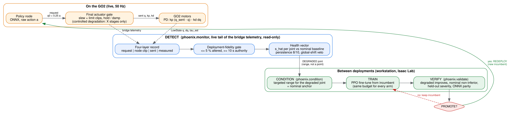

<div align="center">

# go2-phoenix

**Closed-loop sim-to-real learning for the Unitree GO2 quadruped.**

[](https://github.com/yusufdxb/go2-phoenix/actions/workflows/ci.yml)
&nbsp;
&nbsp;[](LICENSE)
&nbsp;

</div>

---

The **Phoenix loop** trains a locomotion policy in simulation, deploys it to
the real robot, captures the failures that happen on hardware, replays those
failures in simulation under a randomized physics sweep, and fine-tunes the
policy on that failure-seeded distribution. The improved policy goes back to
the robot. Every stage is a concrete Python module with its own CLI,
configuration, and (where possible) unit tests.

<p align="center">
  
</p>

## Demo

A 60-second walkthrough: thousands of robots training in parallel in Isaac
Sim, the trained policy tracking velocity commands with a live telemetry
overlay, and where the project stands.

<p align="center">
  <a href="https://youtu.be/Nu0oWyJJbEM">
    
  </a>
</p>

## Project status

The locomotion policy is trained and verified in simulation. The sim-to-real
deploy stack (ONNX export, the ROS 2 policy node, the fail-closed safety
layer) has run end-to-end on the real GO2; that live run surfaced a per-step
slew-rate saturation (about 33% at `cmd_vel = 0`) that no on-robot stand has
yet cleared. On-robot locomotion validation (Gate 7) is the current front
line. [`EVIDENCE.md`](EVIDENCE.md) is the verified / inferred / not-validated
ledger for every claim below.

| Stage | State | Detail |
|---|:---:|---|
| Simulation training (PPO, layered-YAML env) | ✅ Done | rsl_rl, ~10 shell entry points |
| Locomotion policy trained and sim-verified | ✅ Done | stand-v3 sim eval: 32/32 success, 0.33% slew saturation (sim only) |
| ONNX export and torch / onnxruntime parity gate | ✅ Done | `verify_deploy`, max drift 9.5e-7 |
| ROS 2 deploy stack and fail-closed safety layer | ✅ Done | 3 bridges, policy node, shared slew cap |
| Deploy stack ran end-to-end on the GO2 | ✅ Done | live on the Jetson 2026-04; surfaced the 33% slew saturation, no stand passed |
| Failure detector and Parquet trajectory logging | ✅ Done | rule-based attitude / collapse / slip |
| Replay and failure-curriculum fine-tune | ✅ Done | wired and unit-tested; awaiting real parquets |
| Live on-robot stand (Gate 7) | 🟡 In progress | last live run 33% slew saturation on hardware; stand-v3 staged for retry |
| Live velocity tracking (Gate 8) | ⬜ Planned | two-policy mode-switch runtime is ready |
| Posture-offset fix (floating-base DR or floor test) | ⬜ Planned | decision follows the Gate 7 retry |

Full milestone trail: [`docs/changelog.md`](docs/changelog.md).

## Why this repo exists

Most open-source quadruped RL projects stop at "trained in sim, deployed
once." Phoenix is explicitly about the loop *after* the first deployment:
reproducing real failures in sim, using them as training seeds, and shipping
a better policy. The full pipeline is driven by YAML configs and ~10 shell
entry points.

## Quick start

```bash
# Install Isaac Lab 3.0+ (https://isaac-sim.github.io/IsaacLab/).
export ISAACLAB_PATH=/path/to/IsaacLab

# Train a baseline policy (~4h on RTX 5070 at 4096 envs)
./scripts/train.sh configs/train/ppo.yaml

# Export to ONNX, bench it, and print the Jetson bringup steps
./scripts/deploy.sh checkpoints/phoenix-base/latest.pt

# After recording a failure on the real robot, replay it in sim
./scripts/replay.sh data/failures/attitude_2026_04_12.parquet

# Fine-tune with the failure curriculum
./scripts/adapt.sh configs/train/adaptation.yaml
```

For a full layout map, see [`docs/structure.md`](docs/structure.md).

## Two Python contexts, one filesystem

Phoenix runs in two Python environments that never share a process.
Data crosses the boundary as files (`*.onnx`, `*.parquet`, `*.mp4`);
no module imports `torch` *and* `rclpy`.

| Context | Where | Optional extra |
|---|---|---|
| Isaac Lab Python | `$ISAACLAB_PATH/isaaclab.sh -p` | `pip install -e ".[sim]"` |
| System Python + ROS 2 | `/opt/ros/humble` + venv | `pip install -e ".[real]"` |

## Tests

```bash
pip install -e ".[dev]"
pytest tests -m "not sim and not ros"
```

235 unit tests, torch-free and ROS-free by construction. They cover the
config loader, observation builder, failure detector, trajectory logger,
Parquet round-trip, Halton variation sampler, curriculum scheduler, per-env
variation translation, the fail-closed estop / sensor-freshness predicates,
the projected-gravity helper, the `verify_deploy` parity gate, the ONNX-export
observation-normalizer reconstruction, the `reset_bridge` quat/pose
conversion, the lowcmd bridge config builder, the sweep runner, and the
lab-day harness.

Isaac Lab and ROS 2 paths run manually on the hardware:

```bash
pytest tests -m sim    # requires Isaac Lab + GPU
pytest tests -m ros    # requires a running ROS 2 environment
```

## Safety semantics on the deploy path

The real-robot side fails closed by default. `ros2_policy_node` and
`lowcmd_bridge_node` both treat a stale `/phoenix/estop` heartbeat as an
asserted estop, not as "OK to keep going." Every gate is a pure function in
`src/phoenix/sim2real/safety.py` and is unit-tested in `tests/test_safety.py`.

- **Startup is locked.** The policy node refuses to publish until it has
  received a fresh `/phoenix/estop` heartbeat with `data == False` AND fresh
  `/imu/data` AND fresh `/joint_states`. During cold startup with any
  precondition unmet, the node stays silent; the bridge's own fail-closed
  watchdog holds the motors with conservative `hold_kp` / `hold_kd` gains.
- **Past the grace window**, an unmet precondition latches the abort with a
  specific reason (`estop_publisher_missing`, `estop_heartbeat_stale`,
  `external_estop`, `sensor_missing`, `sensor_stale`); the node publishes the
  safe default stand pose.
- **Slew-rate cap is shared.** Both sides call
  `per_step_clip_array(target, current, MAX_DELTA_PER_STEP_RAD)` with the
  constant living in `safety.py`.
- **Wireless / joystick deadman**: stale input *or* released button publishes
  `estop=True` within one tick.

The relevant knobs live under `safety:` in `configs/sim2real/deploy.yaml`.
Defaults are deliberate and tighter than the upstream Unitree examples.

## Configuration model

YAML files under `configs/` support a Hydra-style `defaults:` chain:

```yaml
# configs/env/slippery.yaml
defaults:
  - base
domain_randomization:
  friction_range: [0.05, 0.4]   # overrides base
```

All configs are serialized into each run's log directory as `train.yaml` /
`env.yaml`, so a rollout is fully reproducible from the artifact alone.

## Known limitations

- **Failure-curriculum adaptation.** The `reset_bridge` is wired
  (env-origin-relative poses, xyzw to wxyz quat conversion, configurable
  seed-row and opt-in velocity write) and unit-tested. `adaptation.yaml`
  still ships with `failure_sample_fraction: 0.0` until enough
  hardware-captured parquets exist to validate against. The opt-in velocity
  write passes body-frame velocities into Isaac Lab's world-frame
  `write_root_velocity_to_sim` unrotated; for a failure seeded at a
  non-trivial orientation the injected velocity points the wrong way. It is
  off by default; a proper fix rotates by the base quaternion first.
- **Replay variation application is local-only.** The pure-Python variation
  translation in `replay/apply_variations.py` is unit-tested in CI; the
  Isaac Sim hand-off in `replay/reconstruct.py` is sim-only.
- **rsl_rl 3.0 iter-0 logging artifact.** Fine-tune from a trained baseline
  uses `init_at_random_ep_len=False`; without it, `runner.learn` reports an
  iter-0 "mean reward near 0" even with a byte-exact warm-start. Cosmetic
  only, the warm-start itself is correct.

## Citation

See [`CITATION.cff`](CITATION.cff).

## License

MIT. See [`LICENSE`](LICENSE).
